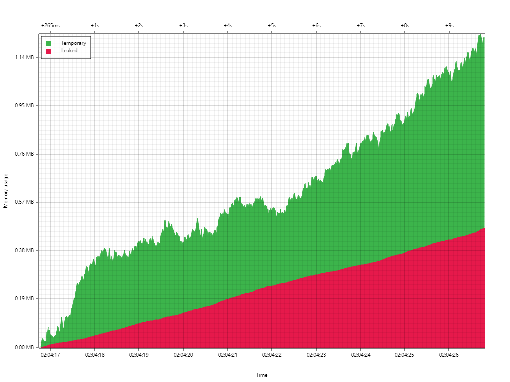
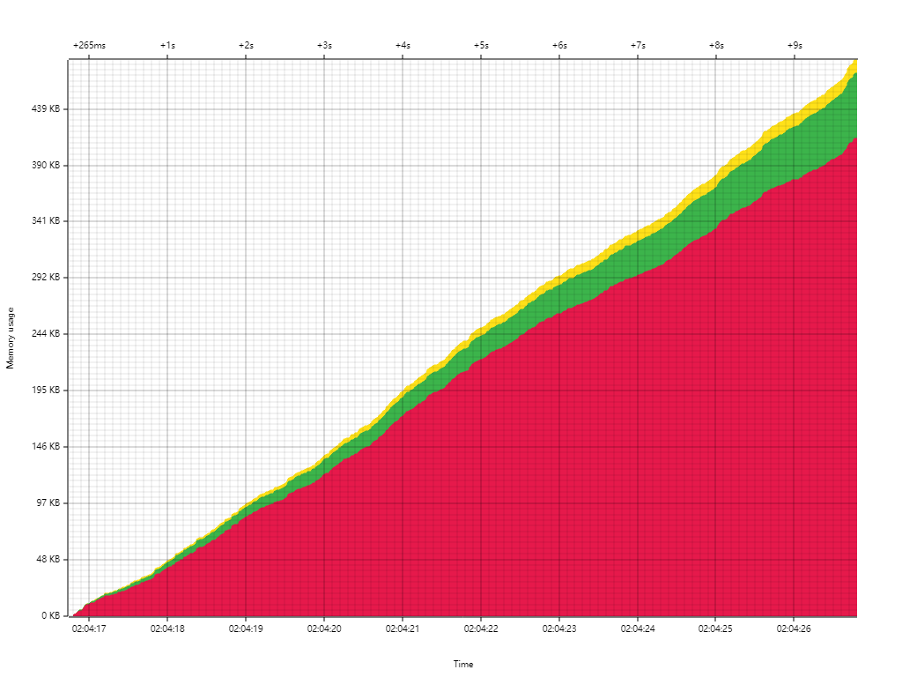

## Install

[bytehound](487c190c_bytehound.zip)

## Usage

### Basic Usage


```bash
$ export MEMORY_PROFILER_LOG=warn
$ LD_PRELOAD=./libbytehound.so ./server
$ ./bytehound server memory-profiling_*.dat
```

### Advanced usage


```bash
$ MEMORY_PROFILER_OUTPUT=./log/memprof_%e_%t_%p_%n.mem \
MEMORY_PROFILER_LOG=info \
MEMORY_PROFILER_LOGFILE=./log/bytehound_%e_%p.log \
LD_PRELOAD=./libbytehound.so \
./server
$ ./bytehound server log/*.mem  
```

## Analysis

### **找出所有明显的内存泄漏**


```rust
graph()
    .add("Leaked", allocations().only_leaked())
    .add("Temporary", allocations())
    .save();
```



### 通过回溯来拆分泄漏部分


```rust
let groups = allocations()
    .only_leaked()
    .group_by_backtrace()
        .sort_by_size();

graph().add(groups).save();
```



### 打印出回溯


```rust
fn analyze_group(list) {
    let list_all = allocations().only_matching_backtraces(list);

    graph()
        .add("Leaked", list_all.only_leaked())
        .add("Temporary", list_all)
        .save();

    println("Total: {}", list_all.len());
    println("Leaked: {}", list_all.only_leaked().len());
    println();
    println("Backtrace:");
    println(list_all[0].backtrace().strip());
}
for i in 0..groups.len() {
    println("group[{}]", i);
    analyze_group(groups[i]);
    println("----------------------------------------------------");
}
```

<br/>

