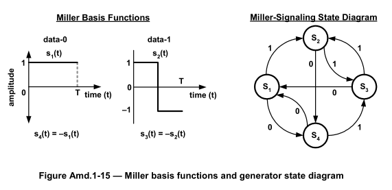
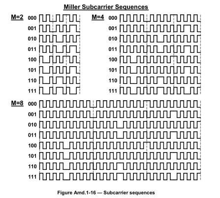

## Miller编码图

1. **Miller基函数:**

	- 图像左侧部分展示了两个波形，每个波形代表如何在时间轴上表示二进制数据0和1。

	- 当数据是1时，波形 s2(t) 在整个周期T内保持不变，不会在周期中间翻转。

	- 当数据是0时，波形 s1(t) 在周期T的一半时刻处于0幅度，并在周期中间翻转。

	- 图中还展示了 s3(t) 和 s4(t) 的关系，表明它们是 s1(t) 和 s2(t) 的相反数。这意味着信号的幅度是相反的。

1. **Miller信号状态图:**

	- 图像右侧部分是一个状态转换图，表明了Miller编码的四种状态 S1, S2, S3, 和 S4 之间的转换。

	- 状态之间的箭头标有0或1，表示如果在给定状态接收到一个0或1，信号将转移到哪个新状态。

	- 比如，从状态 S1 开始，如果接收到1，它将转移到 S2；如果接收到0，它将转移到 S4。

	- 这个状态图有助于理解在连续接收到一串二进制数据时，Miller编码如何在不同的状态间转换，以生成最终的编码信号。

## Miller调制副载波

[//]: # (column_list is not supported)

	[//]: # (column is not supported)

		

	[//]: # (column is not supported)

		

- 副载波编码就是用副载波的波形乘原波形，得到的就是编码后的波形。

