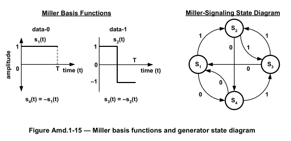
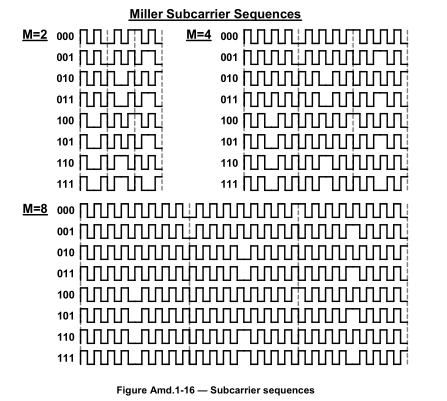
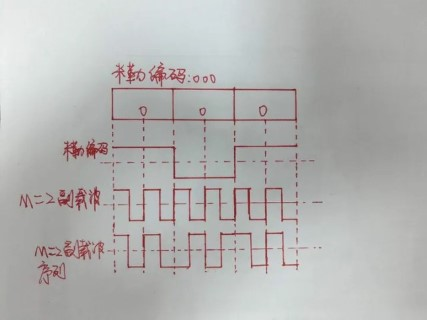

## Miller编码图

1. **Miller基函数:**

	- 图像左侧部分展示了两个波形，每个波形代表如何在时间轴上表示二进制数据0和1。

	- 当数据是1时，波形 $ s2(t) $ 在整个周期T内保持不变，不会在周期中间翻转。

	- 当数据是0时，波形 $ s1(t) $ 在周期T的一半时刻处于0幅度，并在周期中间翻转。

	- 图中还展示了 $ s3(t) $ 和 $ s4(t) $ 的关系，表明它们是 $ s1(t) $ 和 $ s2(t) $ 的相反数。这意味着信号的幅度是相反的。

1. **Miller信号状态图:**

	- 图像右侧部分是一个状态转换图，表明了Miller编码的四种状态 $ S1, S2, S3, $ 和 $ S4 $ 之间的转换。

	- 状态之间的箭头标有0或1，表示如果在给定状态接收到一个0或1，信号将转移到哪个新状态。

	- 比如，从状态 S1 开始，如果接收到1，它将转移到 S2；如果接收到0，它将转移到 S4。

	- 这个状态图有助于理解在连续接收到一串二进制数据时，Miller编码如何在不同的状态间转换，以生成最终的编码信号。

## Miller调制副载波

- 副载波编码就是用副载波的波形乘原波形，得到的就是编码后的波形。

## 频谱、功率谱

### **频谱（Spectral Analysis）**:

1. **连续信号的频谱**

	对于连续时间信号 $ x(t) $，其频谱可以通过傅里叶变换（FT）计算得到：

	$ X(f) = int_{-\infty}^{+\infty} x(t)e^{-j2\pi ft}dt $

	这里，$ X(f) $ 是信号 $ x(t) $ 在频域的表示，$ f $ 是频率。

1. **离散信号的频谱**

	对于离散时间信号 $ x[n] $，使用离散傅里叶变换（DFT）：

	$ X[k] = \sum_{n=0}^{N-1} x[n]e^{-j2\pi \frac{kn}{N}} $

	其中，$ N $ 是信号样本的总数，$ k $ 是离散频率指标。

### 功率谱求解

1. **连续信号的功率谱密度**

	对于连续信号 $ x(t) $，其功率谱密度可以通过以下步骤计算得到：

	1. **计算自相关函数**：首先，计算信号的自相关函数 $ R(\tau) $，这是信号与其自身延迟版本的卷积：

		$ R(\tau) = \int_{-\infty}^{\infty} x(t)x(t+\tau)dt $

		自相关函数提供了信号在不同时间延迟下的相似性度量。

	1. **傅里叶变换自相关函数**：然后，对自相关函数进行傅里叶变换以获得功率谱密度 $ P(f) $：

		$ P(f) = \int_{-\infty}^{\infty} R(\tau)e^{-j2\pi f\tau}d\tau $

		这个变换将自相关函数从时间域转换到频率域，提供了信号功率如何分布在不同频率上的视图。

1. **离散信号的功率谱密度**

	对于离散信号 $ x[n] $，功率谱密度的计算略有不同：

	1. **周期图法**：这是一种直接方法，通过计算信号的离散傅里叶变换（DFT）的模的平方来估计功率谱：

		$ P[k] = |X[k]|^2 $

		其中 $ X[k] $ 是信号 $ x[n] $ 的DFT。这种方法简单直接，但可能不适用于所有类型的信号，尤其是那些非平稳信号。

	1. **Welch方法**：这是一种改进的周期图法，通过将信号分割成重叠的段，对每段应用窗函数，然后计算每段的DFT，最后对所有段的功率谱取平均。这种方法可以减少估计的方差，改善对于非平稳信号的处理：

		1. 将信号分割成多个重叠的段。

		1. 对每个段应用窗函数（如汉宁窗）。

		1. 计算每个窗口化段的DFT，然后计算其模的平方以得到功率谱。

		1. 对所有段的功率谱取平均，得到最终的功率谱密度估计。

		 

		 

